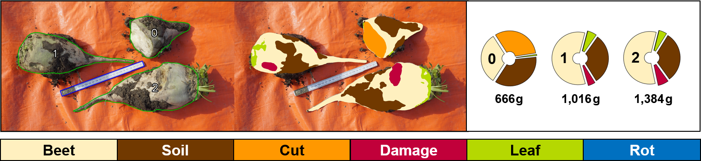
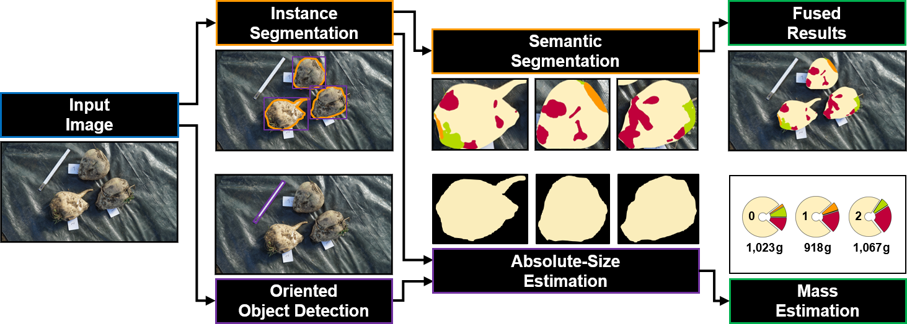

# SemanticSugarBeets



SemanticSugarBeets is a comprehensive framework and dataset designed for analyzing post-harvest and post-storage sugar beets using monocular RGB images. It supports three key tasks: instance segmentation to identify and delineate individual sugar beets, semantic segmentation to classify specific regions of each beet (e.g., damage, soil adhesion, vegetation, and rot) and oriented object detection to estimate the size and mass of beets using reference objects. The dataset, which is available [here](https://zenodo.org/records/15393471), includes 952 annotated images with 2,920 sugar-beet instances, captured both before and after storage. This repository contains the complete processing algorithm along with a demo application. For more details, refer to the [paper](https://arxiv.org/pdf/2504.16684) and [poster](./figures/ssb_poster.pdf) presented at the Agriculture-Vision Workshop at CVPR 2025.

## Processing Algorithm and Learning Tasks

The source code includes a framework for sugar beet delineation, segmentation and mass estimation, along with a demo application.



The algorithm relies on trained models for three learning tasks, each designed to address specific aspects of sugar-beet analysis:

1. __Instance Segmentation__  
   Detect and delineate entire sugar-beet instances in an image. This task provides contours of individual beets, which is useful for counting and localization.

2. __Semantic Segmentation__  
   Perform fine-grained segmentation of each beet instance to classify its regions into specific categories relevant to quality assessment:
   - _Beet_: healthy, undamaged beet surfaces
   - _Cut_: areas where the beet has been topped or trimmed
   - _Leaf_: residual vegetation attached to the beet
   - _Soil_: soil adhering to the beet's surface
   - _Damage_: visible damage on the beet
   - _Rot_: areas affected by rot

3. __Oriented Object Detection__  
   Detect and estimate the position and orientation of reference objects (folding-ruler elements and plastic signs) within the image. These objects are used for scale estimation to calculate the absolute size and mass of sugar beets.

## Setup

1. Clone the repository:
   ```bash
   git clone https://github.com/semanticsugarbeets/semanticsugarbeets.git
   cd semanticsugarbeets
   ```

2. (Optional) Create a conda environment:
   ```bash
   conda create -n semanticsugarbeets python=3.11
   conda activate semanticsugarbeets
   ```

2. Install the dependencies:
   ```bash
   pip install -r requirements.txt
   ```

## Usage

Use the demo application to process a directory of input images and visualize the results:

```bash
python demo.py --input_dir <path_to_input_images> --results_dir <output_directory>
```

Default models are loaded from the repository if they are not explicitly specified. To run custom models instead, use the following arguments:

```bash
python demo.py --input_dir <path_to_input_images> --results_dir <output_directory> \
    --coarse_model <path_to_beet_delineation_model> --fine_model <path_to_semantic_segmentation_model> \
    --marker_model <path_to_marker_detection_model>
```

For additional options and documentation, use:
```bash
python demo.py --help
```

## License

This work is licensed under a [Creative Commons Attribution-NonCommercial-ShareAlike 4.0 International License](http://creativecommons.org/licenses/by-nc-sa/4.0/).

[![CC BY-NC-SA 4.0][cc-by-nc-sa-image]][cc-by-nc-sa]

[cc-by-nc-sa]: http://creativecommons.org/licenses/by-nc-sa/4.0/
[cc-by-nc-sa-image]: https://licensebuttons.net/l/by-nc-sa/4.0/88x31.png

## Citing
If you use the SemanticSugarBeets dataset or source code in your research, please cite the following paper to acknowledge the authors' contributions:

```BibTeX
@InProceedings{Croonen_2025_CVPR,
  title     = {SemanticSugarBeets: A Multi-Task Framework and Dataset for Inspecting Harvest and Storage Characteristics of Sugar Beets},
  author    = {Croonen, Gerardus and Trondl, Andreas and Simon, Julia and Steininger, Daniel},
  booktitle = {Proceedings of the IEEE/CVF Conference on Computer Vision and Pattern Recognition (CVPR) Workshops},
  month     = {June},
  year      = {2025}
}
```